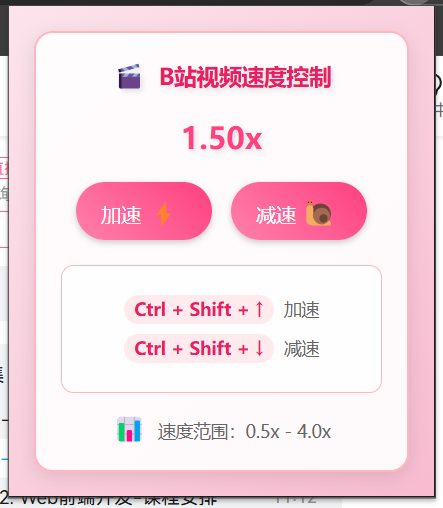

# B站视频速度控制

一个简单好用的Chrome扩展，让你可以随心所欲地控制B站视频的播放速度！🚀

## 功能特点

- 🎯 支持0.5x到4.0x的播放速度调节
- ⌨️ 快捷键控制：
  - `Ctrl + Shift + ↑` 加速
  - `Ctrl + Shift + ↓` 减速
- 🎨 可爱的弹出窗口界面
- 💫 优雅的速度提示消息
- 💾 自动保存上次播放速度

## 界面展示

### 弹出窗口


### 速度提示消息


## 安装方法

1. 下载本仓库到本地
2. 打开Chrome浏览器，进入扩展程序页面（chrome://extensions/）
3. 开启右上角的"开发者模式"
4. 点击"加载已解压的扩展程序"
5. 选择本扩展的文件夹即可

## 使用方法

### 快捷键控制
- 使用 `Ctrl + Shift + ↑` 增加播放速度
- 使用 `Ctrl + Shift + ↓` 降低播放速度
- 每次调整速度为0.25x

### 弹出窗口控制
1. 点击Chrome工具栏中的扩展图标
2. 在弹出窗口中点击"加速"或"减速"按钮
3. 当前播放速度会实时显示在窗口中

## 速度范围

- 最小速度：0.5x
- 最大速度：4.0x
- 调整步长：0.25x

## 注意事项

- 快捷键可能会与其他扩展或应用程序冲突
- 如果快捷键不起作用，请检查是否有其他程序占用了相同的快捷键
- 建议在B站视频页面使用本扩展
- 全屏模式下速度提示消息可能无法显示（已知问题）

## 代码结构

```
bilibili-3x-speed/
├── manifest.json      // 扩展配置文件
├── background.js      // 后台脚本
├── content.js         // 内容脚本
├── popup.html         // 弹出窗口界面
├── popup.js          // 弹出窗口脚本
└── README.md         // 说明文档
```

## 常见问题

1. 快捷键不起作用？
   - 检查是否有其他程序占用了相同的快捷键
   - 确保扩展已正确安装并启用
   - 刷新页面后重试

2. 速度提示消息不显示？
   - 确保页面已完全加载
   - 检查是否有其他扩展干扰
   - 刷新页面后重试
   - 全屏模式下可能无法显示（已知问题）

## 更新日志

### v2.0.0
- 优化界面设计
- 改进速度提示消息样式
- 修复已知问题

### v1.0.0
- 初始版本发布
- 支持快捷键控制
- 支持弹出窗口控制
- 添加速度提示消息
- 优化界面设计

## 贡献指南

自己修改吧…………

## 许可证

MIT License

---

## 快捷键冲突？ 🔑

如果快捷键被占用了...

1. 进入插件详情页 → 点击 **键盘快捷键**
2. 重新绑定其他组合（比如 `Ctrl+.` 或 `Ctrl+Alt+↑`）

---
